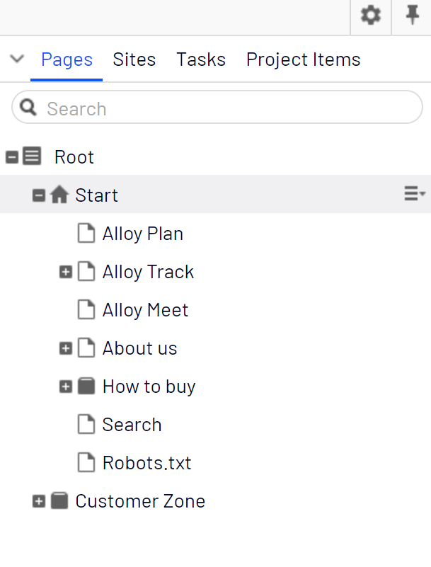
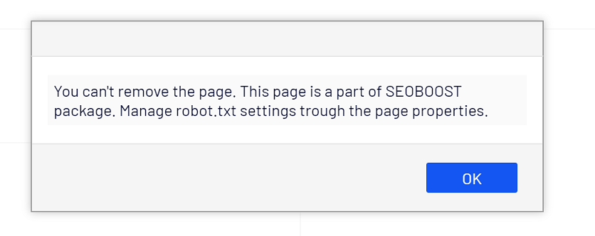
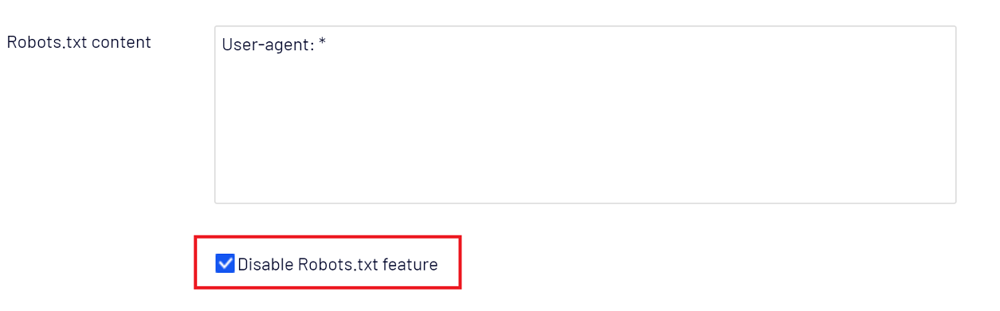

# SEOBOOST for EPiServer

## Description
This package facilitates developers and editors to improve the SEO ranking of the website by utilizing helper methods & features provided.

## Features
The package provides the following helper methods & features:
* Canonical Link 
* Alternate Links (hreflang attributes)
* Breadcrumbs items
* robots.txt

## How to install
Install NuGet package from Episerver NuGet Feed:

    Install-Package SeoBoost

## How to use

Include the follow **@ using SeoBoost.Helper** at top of the Mater page.
     
### Canonical link
Use the following extension **@Html.GetCanonicalLink()** within **<head></head>** section.
     
### Alternate links (hreflang attributes)
Use the following extension **@Html.GetAlternateLinks()** within **<head></head>** section.

### Breadcrumbs items
Use the following extension **@Html.GetBreadcrumbItemList()** where required.

### robots.txt

The idea behind this feature is simple, provide editors with the flexibility to change robots.txt file on the go. 

The Robots.txt page (backed by SBRobotsTxt PageType) will automatically be created for the site under Start Page. 

The physical rebots.txt file content (if any) will be replaced with the CMS robobts.txt page content. The fallback behaviour of /robots.txt URL is the content of physical rebots.txt file (if any) otherwise the default 404 error page will be shown.

**IMPORTANT**: If there is a physical robot.txt exist in the site root, always purged the CDN cache after the deploy or site restart. It is a recommendation to delete physical robots.txt file from the site root if you want to use editable robot.txt.

There are restrictions in place to move (change parent) or delete the Rebots.txt page. 

#### How to enable robots.txt feature
The editable robot.txt feature is disabled by default and can be enabled by setting "Disable Robots.txt feature" property to "true" in the Robotx.Txt page. 

### Additional helper methods

There are some helper methods in the package to get external URLs of the page. The developer can use these methods for their implementations 

usage 

      var urlHelper = ServiceLocator.Current.GetInstance<SeoBoost.Business.Url.IUrlService>();

There are three methods available to get external URL for the content 

       string GetExternalUrl(ContentReference contentReference);
       string GetExternalFriendlyUrl(ContentReference contentReference, string culture);
       string GetExternalFriendlyUrl(ContentReference contentReference);

## Changelog
### Changes in version 1.5.0
1. Added functionality to support editable robots.txt in CMS 
